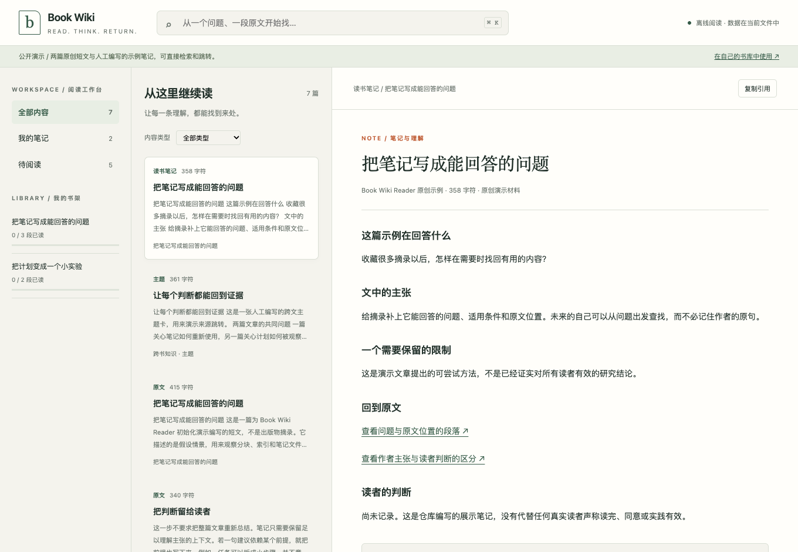

# Book Wiki Reader

把读过的内容找回来，让每条理解都能回到原文。

**[打开交互演示 →](https://ginbrooks.github.io/demos/book/)** · [看共读规则](SKILL.md) · [查看原创示例](examples/README.md)



Book Wiki Reader 包含一个 **Python 导入器、离线阅读工作台和 Codex 共读 skill**。导入文本后，工作台把原文分块和 Markdown 笔记放在一起：按问题搜索，打开命中的段落，从笔记跳回来源，再继续阅读。无需安装依赖、注册账号或提供 API key。

需要 AI 共读时，再让 Codex 围绕原文解释论证、提出问题并整理经过读者确认的理解。网页本身不会自动生成摘要，也不会假装已经读完一本书。

## 两条命令，先试一遍

需要 Python 3.9+。下载或克隆本仓库后，在仓库目录运行：

```bash
python3 scripts/build_reader.py --demo --output reader.html
python3 -m http.server 8000 --bind 127.0.0.1
```

打开 [本机阅读工作台](http://127.0.0.1:8000/reader.html)。也可以直接双击 `reader.html`；部分浏览器会限制本地文件保存阅读进度，遇到这种情况使用上面的本机地址。

演示只包含两篇原创短文、人工编写的阅读笔记与主题卡。可以实际试这些动作：

1. 搜索 `观察`，同时找到两篇文章和主题卡里的相关内容。
2. 打开阅读笔记，点击“查看问题与原文位置的段落”，跳回准确的来源分块。
3. 在原文中搜索关键词，看高亮位置；点击“下一段”继续。
4. 将某一段标为已读，刷新后从书架进度接着读。

所有示例文字都明确标为演示，不含私人书籍、真实用户讨论或假造的 AI 阅读结果。

## 已经实现了什么

| 部分 | 当前行为 |
| --- | --- |
| Python 脚本 | 归档本地文件；将 txt/md 等纯文本分块；生成索引、来源记录、笔记模板和上下文目录；重复运行时保留已有内容。只使用 Python 标准库，不调用模型。 |
| 离线工作台 | 导出一个自带数据与界面的 HTML；跨书、跨笔记关键词检索；正文高亮；笔记与来源分块互相跳转；按书籍或类型筛选；原文分页与浏览器本地已读进度。 |
| Codex 工作流 | 根据 skill 指令生成阅读地图、解释论证、提出问题，并在读者回应后整理笔记。效果取决于模型、输入材料和实际执行过程。 |
| 笔记结构 | 提供 book、theme、idea、author、reading-plan 五类模板；分层保存原文、摘要和读者观点。初始化后摘要与观点字段为空，由后续共读填写。 |

工作流有三个具体选择：

- **先看地图再深入。** 先展示目录、主要问题和阅读建议，让读者决定从哪里读。
- **让读者参与判断。** 每个阅读单元先解释问题、作者答案和证据，再等待读者回应；不把 AI 猜测写成用户观点。
- **原文与理解分开保存。** 原文留在 `raw/`，可复用笔记留在 `wiki/`，讨论时可以回到对应分块核对。

长书采用分层上下文：原文分块 → 分块摘要 → 阅读单元 → 章节摘要 → 全书骨架。快速检视所得的骨架标为暂定；全书索引需要逐块读取。这个设计旨在减少后续重复搬运全文，**目前没有 token 节省或阅读准确率的量化评测**。

## 安装与开始

需要 Python 3.9+。AI 共读还需要能加载本地 skill 的 Codex 环境。

```bash
mkdir -p ~/.codex/skills
git clone https://github.com/ginbrooks/book-wiki-reader-skill.git ~/.codex/skills/book-wiki-reader
```

下载 ZIP 时，将仓库内容放入 `~/.codex/skills/book-wiki-reader/`。如果配置了其他 skills 目录，使用对应目录。开启新会话后，可以对 Codex 说：

```text
用 $book-wiki-reader 把这本书读进我的 Book Wiki。
```

也可以先用脚本导入自己的文本：

```bash
python3 ~/.codex/skills/book-wiki-reader/scripts/init_book_wiki.py \
  --root ~/Documents/Book-Wiki \
  --source "/path/to/book.txt" \
  --title "书名" \
  --author "作者"
```

默认根目录为当前用户的 `~/Documents/Book-Wiki`，可用 `--root` 指定其他位置。文本默认按约 8000 字符分块，可用 `--chunk-size` 调整；`--no-chunks` 仅归档、不切分文本。

## 打开自己的阅读工作台

导入文本后，在本仓库目录运行：

```bash
python3 scripts/build_reader.py \
  --root ~/Documents/Book-Wiki \
  --output ./reader.html
```

生成器读取 `raw/books/*/chunks/*.md` 和 `wiki/` 下的五类笔记，不修改这些原文件，也不会上传数据。修改 Markdown 或导入新书后，再运行一次命令即可更新网页。阅读进度仅保存在当前浏览器中，不回写笔记、不跨设备同步。

在 Markdown 笔记中用 **相对于 Wiki 根目录的来源路径** 建立链接，工作台会把它变成可点击的原文跳转，并在原文下面列出关联笔记：

```markdown
[核对这条判断的原文](raw/books/my-book/chunks/chunk-0002.md)
```

也支持常见的相对 Markdown 链接。没有明确来源链接的读书笔记只提供“回到这本书第一段”的入口，不假定整条笔记都由某一段证明。

**导出的 HTML 包含选中书库的原文和笔记。** 分享页面等同于分享其中的文字。生成器会去掉导入器写入的绝对路径元数据，但不会自动清除正文里的个人信息；不要将自己的导出文件直接提交到公开仓库。公开演示由 `--demo` 单独构建。

## 不用模型也能跑的示例

仓库附带一篇为演示编写的短文。它不是书籍摘录，也不包含假造的用户讨论或 AI 阅读结果。在仓库根目录运行：

```bash
python3 scripts/init_book_wiki.py \
  --root ./example-output \
  --source ./examples/reading-note.md \
  --title "把笔记写成能回答的问题" \
  --author "Book Wiki Reader 示例" \
  --slug reading-note-demo \
  --chunk-size 300
```

然后打开 `example-output/raw/books/reading-note-demo/chunk-index.md` 看分块索引，打开 `example-output/wiki/books/reading-note-demo.md` 看初始化笔记。摘要与观点部分此时应当仍为空。再运行 `python3 scripts/build_reader.py --root ./example-output --output ./reader.html`，即可在工作台浏览这份导入结果。

[示例说明](examples/README.md)介绍预期产物和如何继续在 Codex 中共读。验证导入、原文完整性及重复运行保护：

```bash
python3 -m unittest discover -s tests -v
```

目前 10 个自动测试验证原文保留、重复导入保护、跨文来源引用、导出可复现、不修改笔记、忽略书库外符号链接，以及不把正文解释为脚本。GitHub Actions 在 Python 3.9、3.12、3.13 上运行测试并检查演示与源码一致。这些测试不评估模型的阅读质量。

浏览器另行验证了中文跨文检索与高亮、来源跳转、刷新保留已读状态，以及 390px 手机视口的阅读和返回流程。桌面截图来自实际页面的 1360 × 940 视口。

## 产物结构

```text
Book-Wiki/
  raw/books/<book-slug>/
    original/                 原文件副本
    chunks/                   可按需读取的原文分块
    chunk-index.md            分块编号、长度与首行索引
    source.md                 来源、导入日期和文件位置
    stack/                    分块、单元、章节摘要与读者记忆
  raw/inbox/
  wiki/
    books/
    themes/
    ideas/
    authors/
    reading-plans/
  templates/
```

完整共读规则见 [SKILL.md](SKILL.md) 和 [reading-workflow.md](references/reading-workflow.md)。界面源码位于 [assets/reader.html](assets/reader.html)，数据收集与导出逻辑位于 [scripts/build_reader.py](scripts/build_reader.py)。

重建公开演示：

```bash
python3 scripts/build_reader.py --demo --output docs/demo/index.html
```

## 当前边界

- PDF、EPUB、DOCX 可以归档，但脚本不会提取其中的文字；需要先转换成 txt/md 再导入。
- 初始化只生成文件和模板，不会自动生成摘要、主题卡或跨书关联。
- 同一 slug 的已有文件与分块会保留。导入修订版或另一本同名书时，请指定新的 `--slug`，避免沿用旧内容。
- 工作台是只读导出，不在网页里编辑 Markdown。支持常见标题、段落、列表和链接，不是完整的 Markdown 排版引擎。
- 检索是本机关键词匹配：空格分开的词需要全部出现。没有向量检索、自动问答或自动跨书关联；大量全文会增加 HTML 大小和浏览器内存占用。
- 工作台暂不展示 `stack/` 摘要文件；它们继续用于 Codex 共读上下文。
- 原文只保存在用户指定的本地目录。将材料交给 Codex 处理时，应遵守所用服务的数据规则；发布示例时不要上传私人笔记或无权公开的书籍全文。
